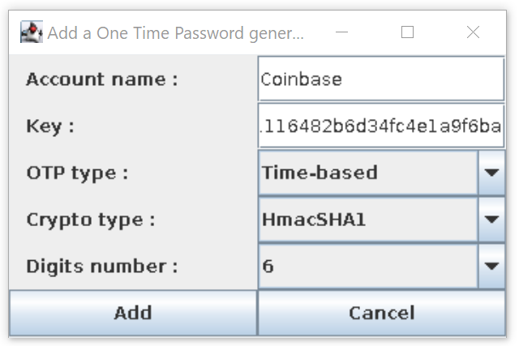

# One-Time Password Generator
 
One-Time Password Generator is a Java executable (Jar). It generates one-time passwords using a time algorithm (see [FC 6238](https://tools.ietf.org/html/rfc6238)) or a HMAC algorithm (see [FC 4226](https://tools.ietf.org/html/rfc4226)).


## Requirements

Building the One-Time Password Generator executable requires the following tools:
- X.org graphic system (see [www.x.org](https://www.x.org/wiki/))
```bash
sudo apt-get install xorg
```
- OpenJDK (see [openjdk.java.net](https://openjdk.java.net))
```bash
sudo apt-get install openjdk-8-jre
```

## Compilation

To build the executable, use:

```bash
make all
```

## Usage

To launch the Java executable, use:
```bash
make run
```
Then, add a new one-time password and click on the "Add" button :



## License

Distributed under the [Apache License, Version 2.0](http://www.apache.org/licenses/). See [`LICENSE`](LICENSE) for more information.
